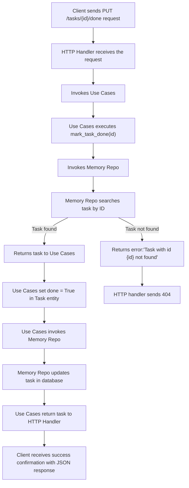
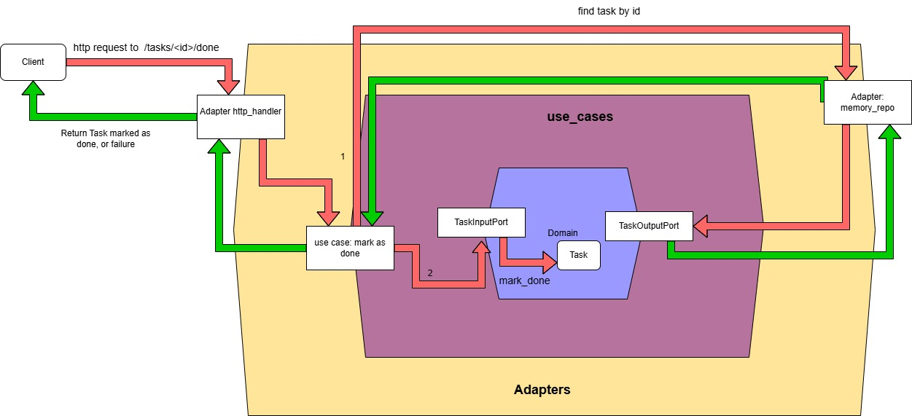

# Task Manager – Hexagonal Architecture

This service allows you to create and list tasks using a hexagonal architecture (ports and adapters). Business logic is decoupled from infrastructure details, such as the web framework or storage.

## 📋 Endpoints disponibles

### ➕ Create a task

Create a new task with a title.

bash
curl -X POST http://localhost:5000/tasks \
  -H "Content-Type: application/json" \
  -d '{"title": "Aprender arquitectura hexagonal"}'


### 📄 List all tasks

Returns a list of all created tasks.

bash
curl http://localhost:5000/tasks


### ✅ Mark task as done

Marks a specific task as completed.

bash
curl -X PUT http://localhost:5000/tasks/<task_id>/done


## Usage and Testing

### Create a Task

bash
curl -X POST http://localhost:5000/tasks \
     -H "Content-Type: application/json" \
     -d '{"title": "Finish challenge"}'


Expected response:

json
{
  "id": "uuid-generated-id",
  "title": "Finish challenge",
  "done": false
}


### Mark a Task as Done

Replace <id> with the ID returned when creating the task.

bash
curl -X PUT http://localhost:5000/tasks/<id>/done


Expected response:

json
{
  "id": "<id>",
  "title": "Finish challenge",
  "done": true
}

---

# Modifications Made

## 1. Modify the Domain

In `entities.py`, there is a method `mark_done()` in the `Task` entity to change the `done` status to `True`.

```python
@dataclass
class Task:
    id: str
    title: str
    done: bool = False

    def mark_done(self):
        self.done = True
```

## 2. Extend the Input Port

In `ports.py`, the abstract method was added:

```python
def mark_task_done(self, task_id: str) -> Task: pass
```

## 3. Update the Use Case

In `use_cases.py`, the logic for marking a task as done was implemented using the repository to find and update the task:

```python
def mark_task_done(self, task_id: str) -> Task:
    task = self.repo.find_by_id(task_id)
    task.mark_done()
    self.repo.update(task)
    return task
```

## 4. Improve the Repository

In `memory_repo.py`, methods were added to find a task by ID and update it:

```python
def find_by_id(self, task_id: str) -> Task:
    for task in self.tasks:
        if task.id == task_id:
            return task
    raise ValueError(f"Task with id {task_id} not found")

def update(self, task: Task) -> None:
    for i, existing_task in enumerate(self.tasks):
        if existing_task.id == task.id:
            self.tasks[i] = task
            return
    raise ValueError(f"Task with id {task.id} not found")
```

## 5. Add New HTTP Endpoint

In `http_handler.py`, a route was added to handle marking tasks as done:

```python
@app.route("/tasks/<task_id>/done", methods=["PUT"])
def mark_task_done(task_id):
    try:
        task = use_case.mark_task_done(task_id)
        return jsonify({"id": task.id, "title": task.title, "done": task.done}), 200
    except ValueError as e:
        return jsonify({"error": str(e)}), 404
```

## Flow Diagrams

### 1. "Mark Task as Done" Functionality Flow



### 2. Hexagonal Architecture with New Feature



---

# Conclusion

This enhancement allows updating task status via API while respecting hexagonal architecture, ensuring modularity and scalability.
